# アニメーション SVG サンプルリポジトリ
自作したアニメーション SVG を格納します。

## フォージビジョンロゴ
1. 左側の楕円と線がフェードイン＋スケールで登場
2. 文字が左から順にスライド＋フェードインで登場
3. 波線が描画アニメーション（stroke-dasharray）で最後に現れる

[リンク](forgevision_logo/forgevision_logo_animated.svg)

## フォージビジョンのスローガン

1. 「共に着実に歩む。」という8文字で、各文字を一文字ずつフェードインするアニメーション  

[リンク](together_steadily/together_steadily_animated_fade.svg)

2. 「共に着実に歩む。」という8文字で、下からスライドしながらフェードインするバージョン

[リンク](together_steadily/together_steadily_animated_slide.svg)

## メニュー
ブラウザによっては動作しないかもしれません。  
Mac のプレビューだと動作します。

1. ホバーすると、中心のドットから外側に向かって波紋のように順番にポップ（拡大→元に戻る）
2. 色も #898989 → #444444 → #555555 と少し濃くなり、インタラクティブ感あり
3. transform-box: fill-box + transform-origin: center で各ドットが自分の中心を基準にスケールする
4. バウンス感のある cubic-bezier(0.34, 1.56, 0.64, 1) イージングで気持ちいい動きを表現

[リンク](menu/menu_animated.svg)

## 矢印
ブラウザによっては動作しないかもしれません。  
Mac のプレビューだと動作します。

1. 通常時: 3本の水平線（ハンバーガーメニュー）
2. ホバー時: 3本の線が下向き矢印（V字 + 縦線）に変形
3. 上の線 → 左斜め下に傾いて V の左半分に
4. 中の線 → 右斜め上から下がって V の右半分に
5. 下の線 → 中央の縦線に変形

[リンク](drawer_menu/drawer_menu_animated.svg)

